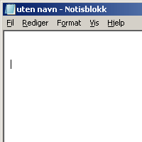

# Accents
 

---

[Download Accents for windows](https://github.com/OMeyer973/Accents/raw/master/Accents.exe)

- Press a key three times or more to apply accents
- Change accents using Settings in the tray menu (Accent needs to be restarted for it to take effect)
- Doesn't work properly with CapsLock is on

## How to have Accents run automatically when I start my PC ?

- [Download Accents](https://github.com/OMeyer973/Accents/archive/master.zip)
- Press Win+R to open the Run dialog, then enter shell:startup and click OK. This will open the Startup folder for the current user.
- Paste Accents.exe and Accents.exe in the Startup folder. Any program linked in this folder will start automatically on startup.
- that's it !

---

V1.1 by Myro (more accents, disabled characters cycling)

based on [Accents V1.0 by Skrommel](http://www.dcmembers.com/skrommel/download/accents/)

2020.01
